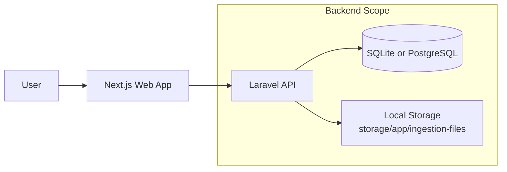
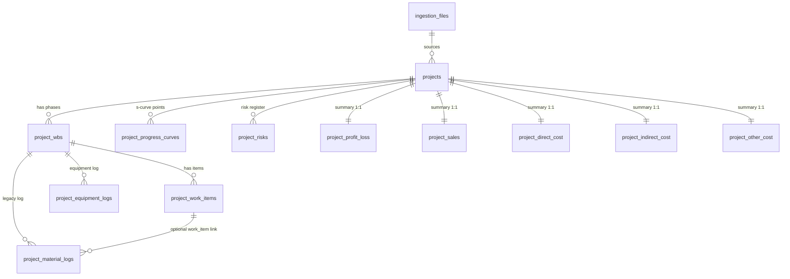
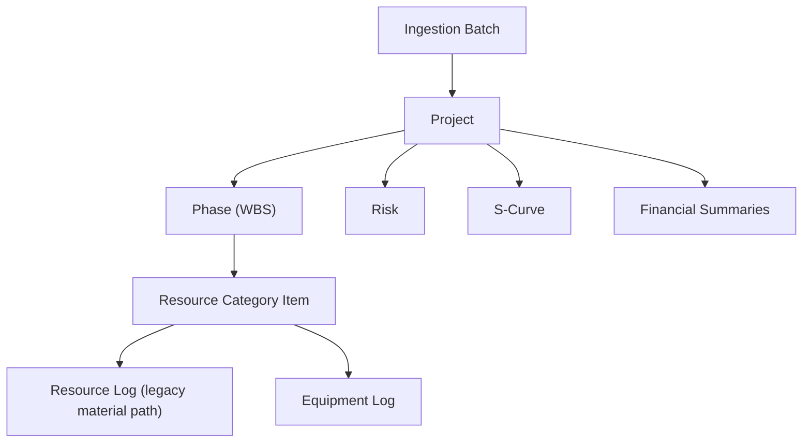
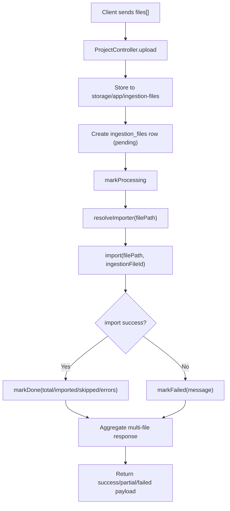
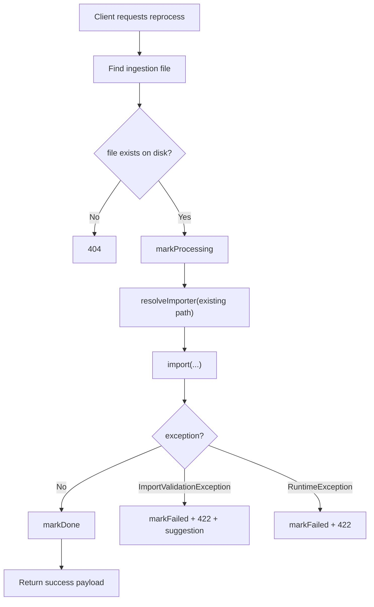
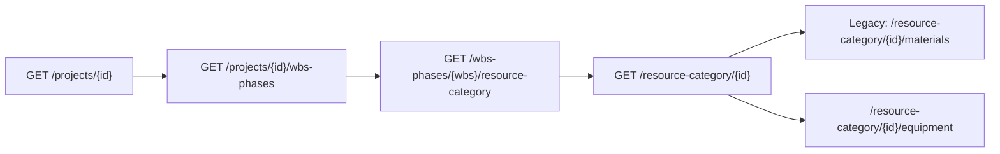
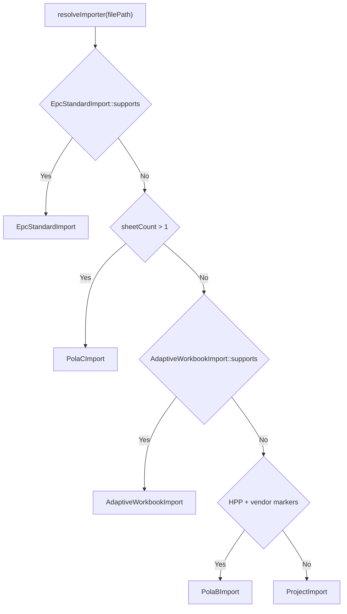

# PoC CPIP-WIKA

CPIP (Construction Project Impact Platform) is a WIKA PoC that ingests Excel workbooks, normalizes project data, computes project health indicators (CPI/SPI), and serves dashboard and drill-down APIs.

## Table of Contents
1. [Overview](#overview)
2. [System Context and Responsibility Boundaries](#system-context-and-responsibility-boundaries)
3. [Architecture](#architecture)
4. [Domain Model and Glossary](#domain-model-and-glossary)
5. [Full Data Model and ERD](#full-data-model-and-erd)
6. [Data Flow Diagrams](#data-flow-diagrams)
7. [API Contracts and Status Matrix](#api-contracts-and-status-matrix)
8. [Importer Internals and Decision Tree](#importer-internals-and-decision-tree)
9. [Data Ingestion Pipeline](#data-ingestion-pipeline)
10. [Setup and Operations](#setup-and-operations)
11. [Ops Runbooks](#ops-runbooks)
12. [Change Log and Known Risks](#change-log-and-known-risks)
13. [Doc Maintenance Contract](#doc-maintenance-contract)

## Overview

- Monorepo apps:
  - `apps/api`: Laravel 12 API
  - `apps/web`: Next.js 16 frontend
- Core behavior:
  - Upload one or many Excel files.
  - Auto-select importer based on workbook shape.
  - Persist data into project, WBS, work item, and supporting tables.
  - Recompute KPI and financial summary projections.
  - Provide dashboard and drill-down APIs.

## System Context and Responsibility Boundaries



Boundaries:
- `apps/web` is consumer/UI and should only call API contracts exposed by `apps/api/routes/api.php`.
- `apps/api` owns importer selection, ingestion lifecycle, and persistence.
- Uploaded files are persisted and reprocessable using `ingestion_files` metadata.

## Architecture

Key source-of-truth files:
- Backend routes: `apps/api/routes/api.php`
- Upload/Reprocess controller: `apps/api/app/Http/Controllers/ProjectController.php`
- Import services: `apps/api/app/Services/*Import.php`
- Field normalization: `apps/api/app/Services/WorkbookFieldMapper.php`
- Frontend API consumer map: `apps/web/lib/api.ts`

Auth model:
- Public read endpoints exist for dashboard/project summary/search.
- Ingestion and detailed drill-down are in auth-protected groups (`auth:sanctum`).

Data ownership model:
- Shared project corpus (not per-user project partitioning in current implementation).
- `ingestion_files` is the operational audit trail for imported artifacts.

## Domain Model and Glossary

Primary domain objects:
- **Ingestion Batch**: one uploaded file represented by `ingestion_files`.
- **Project**: top-level portfolio object in `projects`.
- **WBS Phase**: phase node in `project_wbs` linked to project.
- **Resource Category Item**: work item in `project_work_items`, includes `id_resource` and `resource_category`.
- **Resource Log (legacy naming in endpoint/table areas)**: line details historically grouped under material/equipment logs.
- **Risk**: project risk register line in `project_risks`.

Terminology rule for this document:
- Default term is **resource**.
- Term **material** appears only when describing legacy compatibility (old endpoints/table names).

## Full Data Model and ERD

### Physical ERD (table-level)



### Logical ERD (business entities)



### Schema Notes (critical ingestion tables)

| Table | Purpose | Key Columns | Lifecycle and Ownership |
|---|---|---|---|
| `ingestion_files` | Tracks uploaded files and import status | `stored_path`, `status`, `imported_rows`, `skipped_rows`, `errors` | Created by upload, updated by import/reprocess flow in `ProjectController` |
| `projects` | Project master + KPI base fields | `project_code`, `project_name`, `ingestion_file_id`, KPI-related fields | Upsert/update during imports; linked to one ingestion source at write time |
| `project_wbs` | WBS phases per project | `project_id`, phase name fields | Rebuilt/updated by importer depending on pattern |
| `project_work_items` | Resource category work items | `period_id`, `id_resource`, `resource_category`, cost/progress fields | Filled by importers; used for resource listing and drill-down |
| `project_material_logs` | Legacy material detail rows | `period_id`, optional `work_item_id`, vendor/material columns | Still used by legacy endpoints and some drill-down paths |
| `project_equipment_logs` | Equipment detail rows | `period_id`, equipment/vendor columns | Read by equipment endpoints |
| `project_progress_curves` | Time series progress | `project_id`, period/week, percentages | Filled when source workbook includes curve data |
| `project_risks` | Risk register | `project_id`, impact/probability fields | Imported or maintained via risk endpoints |
| `project_profit_loss`, `project_sales`, `project_direct_cost`, `project_indirect_cost`, `project_other_cost` | Derived financial summary tables | `project_id` unique in each table | Rebuilt from import aggregation pipeline |

### Resource Rename Migration

Migration applied:
- `apps/api/database/migrations/2026_05_05_000001_rename_material_fields_to_resource_fields_on_project_work_items.php`

Renamed columns in `project_work_items`:
- `id_material` -> `id_resource`
- `material_category` -> `resource_category`

Why legacy `/materials` endpoints still exist:
- Backward compatibility for existing clients and transitional controller paths.
- Backend and frontend are currently mixed and not yet fully converged.

## Data Flow Diagrams

### Upload End-to-End (`POST /api/projects/upload`)



### Reprocess Lifecycle (`POST /api/ingestion-files/{id}/reprocess`)



### Read Drill-down Path (project to logs)



## API Contracts and Status Matrix

Source of truth:
- Backend definitions: `apps/api/routes/api.php`
- Frontend usage: `apps/web/lib/api.ts`

Status categories:
- **Active**: backend route exists and current frontend uses it.
- **Legacy**: backend route exists but follows old naming or is not primary.
- **Mismatch**: frontend calls route not currently defined in backend (or vice versa for expected replacement path).

### Handover Matrix

| Status | Method | Path | Controller | Auth Scope | Frontend Usage | Test Coverage Signal | Migration Target |
|---|---|---|---|---|---|---|---|
| Active | POST | `/api/projects/upload` | `ProjectController@upload` | Protected (`auth:sanctum`) | `projectApi.upload`, `projectApi.uploadSingle` | Upload tests exist in API suite | Keep |
| Active | POST | `/api/ingestion-files/{id}/reprocess` | `ProjectController@reprocess` | Protected | `ingestionApi.reprocess` | Covered by ingestion-related tests | Keep |
| Active | GET | `/api/ingestion-files` | `ProjectController@ingestionFiles` | Protected | `ingestionApi.list` | Indirectly covered via feature behavior | Keep |
| Active | GET | `/api/ingestion-files/{id}/download` | `ProjectController@download` | Protected | `ingestionApi.downloadUrl` | Indirectly covered | Keep |
| Active | GET | `/api/resources` | `ResourceController@index` | Protected | `resourceApi.list` | `ResourceApiTest` covers resource list/filter flow | Keep as primary resource list |
| Active | GET | `/api/resources/filter-options` | `ResourceController@filterOptions` | Protected | `resourceApi.filterOptions` | `ResourceApiTest` has filter-options assertions | Keep |
| Active | GET | `/api/wbs-phases/{wbsModel}/resource-category` | `WorkItemController@index` | Protected | `periodApi.workItems` | `ResourceApiTest` checks resource-category list path | Keep |
| Active | GET | `/api/resource-category/{resourceCategory}` | `WorkItemController@show` | Protected | `workItemApi.detail` | `ResourceApiTest` checks detail path | Keep |
| Active | GET | `/api/wbs-phases/{wbsModel}/equipment` | `EquipmentLogController@index` | Protected | `periodApi.equipment` | Feature behavior in API tests | Keep |
| Legacy | GET | `/api/materials` | `MaterialController@index` | Protected | Not used in current frontend | No dedicated current frontend path | Replace consumers with `/resources` then deprecate |
| Legacy | GET | `/api/materials/filter-options` | `MaterialController@filterOptions` | Protected | Not used in current frontend | No dedicated current frontend path | Replace consumers with `/resources/filter-options` then deprecate |
| Legacy | GET | `/api/wbs-phases/{wbsModel}/materials` | `MaterialLogController@index` | Protected | Not used by current frontend mapping | Legacy line detail path | Introduce `/wbs-phases/{wbsModel}/resources` or align frontend |
| Legacy | GET | `/api/resource-category/{resourceCategory}/materials` | `MaterialLogController@showByResourceCategory` | Protected | Not used by current frontend mapping | Legacy line detail path | Replace with resource-named endpoint |
| Legacy | GET | `/api/resource-category/{resourceCategory}/equipment` | `EquipmentLogController@showByResourceCategory` | Protected | Not used by current frontend mapping | Existing backend support | Optional consolidation |
| Mismatch | GET | `/api/wbs-phases/{id}/resources` | Not defined | N/A | Used by `periodApi.resources` | N/A | Add backend route or change frontend to legacy path temporarily |
| Mismatch | GET | `/api/resources/{id}` | Not defined | N/A | Used by `resourceApi.detail` | N/A | Add backend route or remove frontend function |
| Mismatch | DELETE | `/api/resources/{id}` | Not defined | N/A | Used by `resourceApi.delete` | N/A | Add backend route or remove frontend function |
| Mismatch | POST | `/api/resources/upload` | Not defined | N/A | Used by `resourceApi.upload` | N/A | Add backend route or remove frontend function |
| Mismatch | GET | `/api/ingestion-log` | Not defined | N/A | Used by `ingestionApi.ingestionLog` | N/A | Add backend route or remove frontend function |

### Deprecation Roadmap (documentation only)

1. Align phase-level resource endpoint naming first.
- Resolve `/wbs-phases/{id}/resources` mismatch by either adding route or adjusting frontend.
2. Resolve `/resources/{id}`, `DELETE /resources/{id}`, `/resources/upload` contract.
3. Once all frontend/resource clients are stable, mark `/materials*` endpoints deprecated in API contract.
4. Remove `/materials*` endpoints in a separate breaking-change release.

## Importer Internals and Decision Tree

Current importer selection order from `ProjectController::resolveImporter()`:



### Importer Matrix

| Importer | Detection Trigger | Expected Workbook Shape | Failure Behavior | Writes Mainly To | Fallback Order |
|---|---|---|---|---|---|
| `EpcStandardImport` | `supports()` true | Standard EPC multi-sheet workbook | Collects warnings/errors, may partially continue by sheet | `projects`, `project_wbs`, `project_work_items`, summary and support tables | Highest priority |
| `PolaCImport` | multiple sheets when EPC not supported | Legacy multi-sheet structured | Runtime/import validation errors bubble to controller handling | `projects` + WBS/work-item/log tables | After EPC |
| `AdaptiveWorkbookImport` | supports flexible single-sheet patterns | Mixed single-sheet with recognizable headers | Returns trace/candidate/conflict metadata for diagnosis | Varies by discovered zones | After PolaC on single-sheet path |
| `PolaBImport` | HPP/vendor marker detection | Single sheet with mixed zones | Controller catches and records failure | Work-item/material/equipment style data | After Adaptive fallback check |
| `ProjectImport` | final default | Flat tabular single sheet | Controller catches and records failure | `projects` and related imported entities | Last fallback |

## Data Ingestion Pipeline

### Upload Contract Summary (`POST /api/projects/upload`)

Request:
- `multipart/form-data`
- preferred key: `files[]`
- accepted fallback key: `file`

Response behaviors:
- `200` when all imported or partial import exists.
- `422` when all files fail.

Top-level response fields:
- `success`, `message`
- `total_rows`, `imported`, `skipped`
- `errors`, `warnings`
- `results[]` per file
- trace diagnostics: `field_trace`, `field_candidates`, `field_conflicts`, `project_row_trace`, `project_row_conflicts`

Per-file result fields:
- `file_id`, `file_name`, `status`
- row counters and diagnostics
- `projects_affected[]`

### Reprocess Contract Summary (`POST /api/ingestion-files/{id}/reprocess`)

Success payload includes:
- `success`, `message`, `file_id`, `status`
- `scanner`, `imported`, `skipped`, `errors`, `warnings`
- trace diagnostics

Error payloads:
- `404`: source file missing
- `422`: validation/runtime import failure

## Setup and Operations

### Backend (`apps/api`)

```bash
composer install
php artisan key:generate
php artisan migrate:fresh
php artisan serve
php artisan test
```

### Frontend (`apps/web`)

```bash
npm install
npm run dev
npm run build
npm run lint
```

## Ops Runbooks

### Day-1 Onboarding Checklist

1. Install dependencies for both apps.
2. Initialize backend env and run migrations/seeds.
3. Start backend and frontend dev servers.
4. Authenticate and verify dashboard loads (`/api/dashboard` data path).
5. Upload one known sample workbook and confirm ingestion response has `results[]` and row counters.
6. Verify reprocess for same file id.
7. Verify drill-down sequence:
   - project list -> project detail -> WBS phases -> resource category -> equipment/material-related logs.
8. Verify resource page loads from `/api/resources` and filter options endpoint.

### Incident Playbook: Upload Fails Validation (422)

Symptoms:
- `ImportValidationException` message returned.
- `unrecognized_columns` and `suggestion` available.

Actions:
1. Inspect response `unrecognized_columns`.
2. Check `WorkbookFieldMapper` aliases and column alias records.
3. Retry upload after alias adjustment.
4. If repeated, test with known-good sample workbook to isolate template issue.

### Incident Playbook: Importer Mismatch or Wrong Parser Path

Symptoms:
- Unexpected `scanner` or poor row mapping.
- Excessive `skipped` rows or field conflicts.

Actions:
1. Inspect `scanner` and trace diagnostics in response.
2. Validate workbook sheet structure against importer matrix.
3. Reprocess the same file after adjustments.
4. If required, add/adjust mapping aliases before retry.

### Incident Playbook: Endpoint Path Mismatch

Symptoms:
- Frontend 404 on resource APIs.

Actions:
1. Compare failing frontend call from `apps/web/lib/api.ts` with `apps/api/routes/api.php`.
2. Classify as `Mismatch` using matrix above.
3. Choose one direction:
   - Add backend route to match frontend contract, or
   - Update frontend to existing backend contract.
4. Update this README matrix after fix.

### Incident Playbook: Missing File on Reprocess/Download

Symptoms:
- 404 from reprocess or download endpoint.

Actions:
1. Check `ingestion_files.stored_path` value.
2. Confirm physical file exists under `storage/app`.
3. If missing, re-upload original source workbook.
4. Review local storage persistence strategy if running in ephemeral environments.

## Change Log and Known Risks

### Recent Change Log

- Added resource-first naming in work-item columns:
  - `id_material` -> `id_resource`
  - `material_category` -> `resource_category`
- Introduced/kept resource endpoints while legacy material endpoints still exist.

### Known Risks

1. Contract drift between frontend and backend routes (currently present mismatches).
2. Legacy endpoint coexistence can confuse new integrations.
3. Importer heuristics may produce partial import quality on highly variable workbook templates.
4. Local file storage availability can affect reprocess/download reliability.

## Doc Maintenance Contract

Update this README in the same PR whenever any of the following changes occur:

1. Route changes in `apps/api/routes/api.php`.
2. Frontend API mapping changes in `apps/web/lib/api.ts`.
3. Migration affecting ingestion/schema/resource naming.
4. Importer selection logic or importer behavior changes.
5. Response contract changes for upload/reprocess payload fields.

Verification checklist before merge:

1. Route accuracy
- Every documented endpoint exists with correct method and auth scope.

2. Frontend mapping accuracy
- Active/mismatch status matches current `apps/web/lib/api.ts` usage.

3. Diagram integrity
- Mermaid blocks render in GitHub preview.

4. Terminology consistency
- Resource is default term; material appears only in legacy or migration history context.
