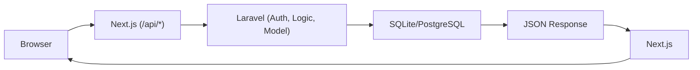
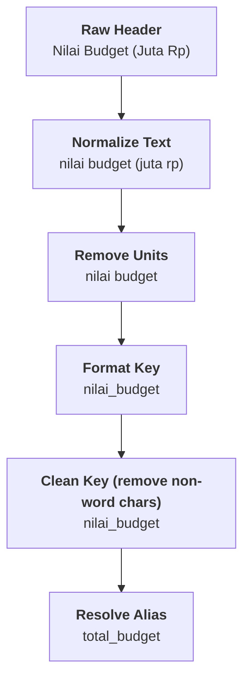
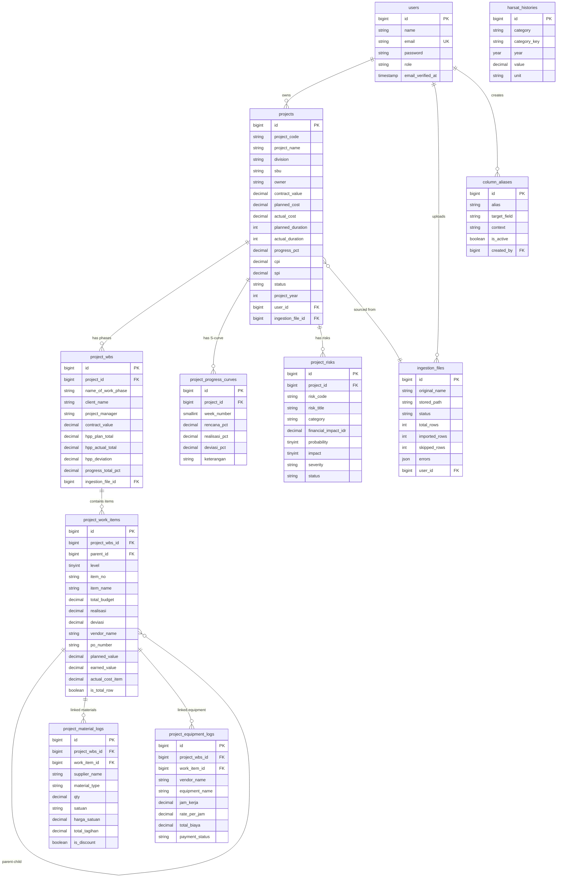
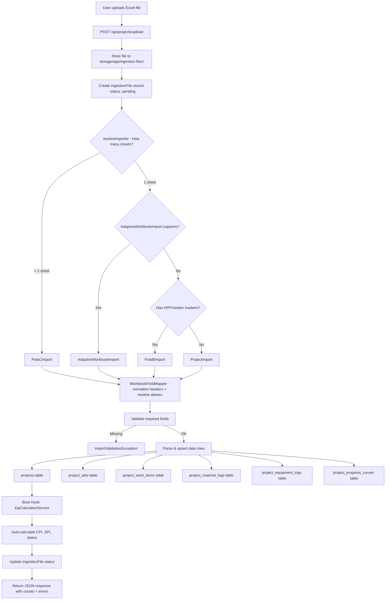
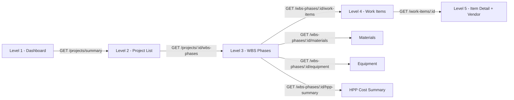
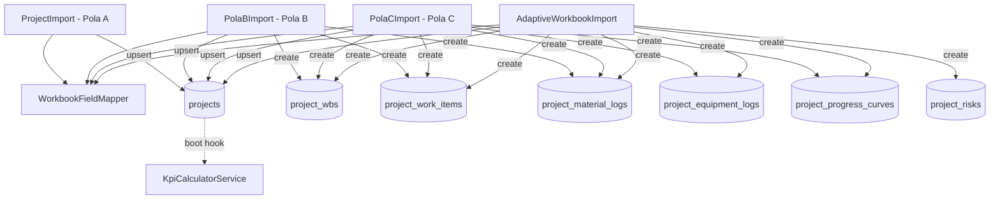
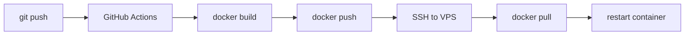

# PoC CPIP-WIKA

> **CPIP** (Construction Project Impact Platform), a PoC for PT Wijaya Karya (WIKA) that ingests Excel project data, calculates KPI metrics (CPI/SPI), and presents dashboards with actionable insights.

---

## Table of Contents

1. [Project Overview](#1-project-overview)
2. [Backend Architecture](#2-backend-architecture)
3. [Data Ingestion Pipeline](#3-data-ingestion-pipeline)
4. [Database Design](#4-database-design)
5. [ERD (Entity Relationship Diagram)](#5-erd-entity-relationship-diagram)
6. [Data Flow Diagrams](#6-data-flow-diagrams)
7. [API Reference](#7-api-reference)
8. [Setup & Operations](#8-setup--operations)
9. [Assumptions & Known Gaps](#9-assumptions--known-gaps)

---

## 1. Project Overview

### Purpose

CPIP enables WIKA project managers to upload Excel workbooks containing project cost, schedule, and vendor data. The system automatically parses diverse spreadsheet formats, calculates Earned Value metrics (CPI/SPI), and surfaces construction project health on an interactive dashboard.

### Core Functionality

| Feature | Description |
|---------|-------------|
| **Excel Ingestion** | Upload single or multi-sheet Excel files; auto-detect layout pattern |
| **KPI Calculation** | CPI (Cost Performance Index) and SPI (Schedule Performance Index) auto-calculated on every save |
| **Dashboard** | Summary KPIs, division/SBU breakdown, risk overview, S-curve visualization |
| **Drill-down Hierarchy** | Project → WBS Phase → Work Item → Vendor/Material detail |
| **Column Alias Mapping** | User-configurable header aliases for non-standard Excel templates |
| **Per-user Data Isolation** | Each user's uploaded data is scoped to their account |

### Monorepo Structure

```
PoC-CPIP-WIKA/
└── apps/
    ├── api/          # Laravel 12 (PHP 8.3) for REST API backend
    └── web/          # Next.js 16 (React 19, TypeScript) for frontend
```

### Key Use Cases

1. **Upload Excel** → System detects format, parses data, calculates KPIs
2. **View Dashboard** → Average CPI/SPI, status breakdown by division, top overrun projects
3. **Drill into Project** → Phase-level budgets → Work item costs → Vendor contract details
4. **Manage Column Aliases** → Map non-standard header names without code changes
5. **Risk Register** → Track project risks with probability/impact scoring

---

## 2. Backend Architecture

### Folder Structure

```
apps/api/app/
├── Enums/
│   └── Division.php              # Infrastructure | Building
├── Exceptions/
│   └── ImportValidationException.php  # Thrown when Excel headers invalid
├── Http/
│   ├── Controllers/
│   │   ├── AuthController.php         # Login, register, logout, me
│   │   ├── ProjectController.php      # CRUD, upload, summary, insight (12 methods)
│   │   ├── ProjectWbsController.php   # WBS phase listing & detail
│   │   ├── WorkItemController.php     # Work items & HPP summary
│   │   ├── MaterialLogController.php  # Material logs by phase/item
│   │   ├── EquipmentLogController.php # Equipment logs by phase/item
│   │   ├── ProgressCurveController.php # S-curve data
│   │   ├── ProjectRiskController.php  # Risk CRUD
│   │   ├── ColumnAliasController.php  # Alias management
│   │   ├── HarsatController.php       # Unit rate trends
│   │   └── RoleController.php         # Role assignment
│   └── Requests/
│       ├── ProjectRequest.php         # Project validation rules
│       └── UploadExcelRequest.php     # File upload validation
├── Models/
│   ├── User.php                  # Sanctum tokens, role field
│   ├── Project.php               # Core entity, auto-KPI via boot hook
│   ├── ProjectWbs.php            # WBS phases (formerly project_periods)
│   ├── ProjectWorkItem.php       # Hierarchical work breakdown items
│   ├── ProjectMaterialLog.php    # Vendor material records
│   ├── ProjectEquipmentLog.php   # Equipment usage records
│   ├── ProjectProgressCurve.php  # S-curve data points
│   ├── ProjectRisk.php           # Risk register, auto-severity
│   ├── IngestionFile.php         # Upload tracking & status
│   ├── ColumnAlias.php           # User-defined header aliases
│   └── HarsatHistory.php         # Unit rate history
├── Services/
│   ├── ProjectImport.php         # Pola A: flat single-sheet parser
│   ├── PolaBImport.php           # Pola B: mixed-layout single-sheet (3 zones)
│   ├── PolaCImport.php           # Pola C: multi-sheet structured parser
│   ├── AdaptiveWorkbookImport.php # Adaptive fallback with confidence scoring
│   ├── WorkbookFieldMapper.php   # Header normalization & 150+ aliases
│   └── KpiCalculatorService.php  # CPI/SPI calculation engine
└── Providers/
    └── AppServiceProvider.php
```

### Request Flow



### Authentication & Authorization

- **Laravel Sanctum** for token-based API authentication
- Every `Project` query is auto-scoped to `Auth::id()` via a global scope in `Project::booted()`
- Composite unique constraint: `[project_code, user_id]` — different users can have the same project code
- Roles: `admin` and `user` (stored in `users.role`)

### Key Design Patterns

| Pattern | Where | Why |
|---------|-------|-----|
| **Service Layer** | `app/Services/` | Business logic separated from controllers |
| **Boot Hook Auto-KPI** | `Project::booted()` | CPI/SPI recalculated on every `Project::save()` |
| **Boot Hook Auto-Severity** | `ProjectRisk::booted()` | Risk severity = probability × impact |
| **Strategy Pattern** | `resolveImporter()` | Selects correct parser based on file structure |
| **Composite Unique** | `projects` table | Per-user data isolation |
| **Alias Resolution** | `WorkbookFieldMapper` | Builtin + DB aliases decouple import from header naming |
| **Forward-Fill** | `PolaCImport::parseEquipmentSheet()` | Handles merged cells in equipment vendor column |

---

## 3. Data Ingestion Pipeline

### Overview

The ingestion pipeline accepts Excel files (.xlsx/.xls), auto-detects the layout pattern, normalizes headers via 150+ aliases, validates data, and upserts into the database. KPIs are auto-calculated on every project save.

### Upload Entry Point

```
POST /api/projects/upload
Content-Type: multipart/form-data
Body: file=@workbook.xlsx (or files[]=@file1.xlsx&files[]=@file2.xlsx)
```

**Controller**: `ProjectController::upload()` handles:
1. Store file to `storage/app/ingestion-files/`
2. Create `IngestionFile` record (status: `pending` → `processing`)
3. Call `resolveImporter($filePath)` to select parser
4. Execute `$importer->import($filePath, $ingestionFileId)`
5. Update `IngestionFile` status (`success` / `failed` / `partial`)
6. Return JSON with counts, errors, affected projects

### Importer Selection Logic

```
resolveImporter($filePath)
│
├─ sheetCount > 1?
│  └─ YES → PolaCImport (multi-sheet structured)
│
├─ AdaptiveWorkbookImport::supports()?
│  └─ YES → AdaptiveWorkbookImport (flexible fallback)
│
├─ Has HPP/vendor table markers?
│  └─ YES → PolaBImport (mixed-layout single sheet)
│
└─ DEFAULT → ProjectImport (flat tabular)
```

### Importer Details

#### Pola A: `ProjectImport` for Flat Tabular Single-Sheet

**When selected**: Default fallback for simple project lists.

**Input format**: Single sheet, row 1 = headers, rows 2+ = one project per row.

**Processing**:
1. Detect if transposed (headers in column A instead of row 1) → transpose if needed
2. Normalize headers via `WorkbookFieldMapper::resolveHeaders()`
3. Validate required columns: `project_code`, `project_name`
4. For each data row:
   - Skip empty rows
   - Validate via Laravel Validator (division enum, numeric ranges, etc.)
   - `Project::updateOrCreate()` keyed on `[project_code, user_id]`

**Tables written**: `projects`

**Error handling**: Row-level validation errors collected as `"Baris {N}: {error}"`. Missing required columns throw `ImportValidationException`.

---

#### Pola B: `PolaBImport` for Mixed-Layout Single Sheet (3 Zones)

**When selected**: Single sheet with both HPP table markers (`budget`, `realisasi`, `deviasi`) AND vendor table markers (`vendor`/`supplier`, `material`, `qty`).

**Input format**: One sheet with 3 vertical zones:
```
┌─────────────────────────────────────────┐
│ ZONA 1: Metadata (key-value pairs)      │  rows 1-N
│   project_code, project_name, manager   │
├─────────────────────────────────────────┤
│ ZONA 2: HPP Table (hierarchical)        │  starts at HPP header row
│   Nomor | Kategori | Budget | Realisasi │
├─────────────────────────────────────────┤
│ ZONA 3: Vendor/Material Table           │  starts at vendor header row
│   No | Vendor | Material | Qty | Harga  │
└─────────────────────────────────────────┘
```


**Processing**:
1. Detect zone boundaries via `findHeaderRowByKeywords()`
2. **Zona 1**: Parse key-value metadata → create `Project` + single `ProjectWbs`
3. **Zona 2**: Parse hierarchical work items → create `ProjectWorkItem` records with parent-child via `detectLevel()`
4. **Zona 3**: Parse material logs → create `ProjectMaterialLog` records
5. Recalculate HPP totals on the WBS phase

**Tables written**: `projects`, `project_wbs`, `project_work_items`, `project_material_logs`

---

#### Pola C: `PolaCImport` for Multi-Sheet Structured

**When selected**: File has more than 1 sheet.

**Input format**: Multiple sheets, each with a specific purpose:

| Sheet Name Keywords | Type | Target Table |
|---------------------|------|-------------|
| `cover`, `summary`, `ringkasan` | COVER | `projects` + `project_wbs` (multiple phases) |
| `hpp`, `rekap`, `biaya`, `detail` | HPP | `project_work_items` |
| `material`, `vendor`, `keuangan` | MATERIAL | `project_material_logs` |
| `alat`, `equipment` | EQUIPMENT | `project_equipment_logs` |
| `curva`, `curve`, `progress`, `earned` | S_CURVE | `project_progress_curves` |

**Processing** (2-pass):

**Pass 1: COVER sheet**:
1. Parse metadata from first ~6 rows (multi-pair format: A:B, C:D, E:F, G:H per row)
2. Create/update `Project`
3. Parse summary table (rows after header) → create **one `ProjectWbs` per Roman-numeral row** (I, II, III...XII)
4. Return `[$project, $phaseMap]` where `$phaseMap = ['I' => ProjectWbs, 'II' => ProjectWbs, ...]`

**Pass 2: Remaining sheets**:
- **HPP Sheet**: Resolve headers, iterate work items. Route each item to correct WBS phase by matching Roman prefix in WBS code (e.g., `I.1` → Phase I, `XII.2` → Phase XII). Create `ProjectWorkItem` with correct `period_id`.
- **Material Sheet**: Parse vendor/material rows → `ProjectMaterialLog`
- **Equipment Sheet**: Parse with forward-fill on `vendor_name` (handles merged cells) → `ProjectEquipmentLog`
- **S-Curve Sheet**: Two sub-formats:
  - *Weekly*: `minggu`, `rencana`, `realisasi` headers → `ProjectProgressCurve` per week
  - *Earned Value*: Group by Roman prefix, aggregate weighted progress → `ProjectProgressCurve`

**Tables written**: `projects`, `project_wbs` (multiple), `project_work_items`, `project_material_logs`, `project_equipment_logs`, `project_progress_curves`

---

#### `AdaptiveWorkbookImport` for Flexible Fallback

**When selected**: Single sheet that passes `supports()` check (finds project metadata or project rows via content scanning).

**Input format**: Anything that doesn't match other patterns like scattered metadata, mixed tables, partial data.

**Key capabilities**:
- Scans entire sheet for metadata candidates with confidence scoring
- Discovers table zones dynamically (work items, materials, equipment, S-curve)
- Splits single catch-all WBS phase into multiple phases if Roman-numeral hierarchy detected
- Derives missing values (costs from work item sums, duration from S-curve length)
- Infers division from keywords (`jembatan`/`tol` → Infrastructure, `gedung`/`tower` → Building)
- Auto-generates sample risks if none exist

**Tables written**: All tables (projects, WBS, work items, materials, equipment, progress curves, risks)

---

### `WorkbookFieldMapper` for Header Normalization Engine

**File**: `app/Services/WorkbookFieldMapper.php`

The mapper is used by all importers to translate diverse Excel header names into canonical field names.

#### Normalization Pipeline



#### Alias Contexts

Each context has its own set of known fields and alias mappings:

| Context | Known Fields | Example Aliases |
|---------|-------------|-----------------|
| `project` | project_code, project_name, division, sbu, owner, contract_value, planned_cost, actual_cost, planned_duration, actual_duration, progress_pct, project_year, ... | `kode_proyek` → project_code, `nama_proyek` → project_name, `nilai_kontrak` → contract_value, `pemberi_tugas` → client_name |
| `work_item` | item_no, item_name, budget_awal, total_budget, realisasi, deviasi, bobot_pct, progress_plan_pct, progress_actual_pct, planned_value, earned_value, vendor_name, ... | `uraian_pekerjaan` → item_name, `wbs` → item_no, `kategori` → cost_category, `pv_bcws` → planned_value, `ev_bcwp` → earned_value |
| `material` | supplier_name, material_type, qty, satuan, harga_satuan, total_tagihan, ... | `vendor` → supplier_name, `lingkup_pekerjaan` → material_type, `nilai_kontrak` → total_tagihan |
| `equipment` | vendor_name, equipment_name, jam_kerja, rate_per_jam, total_biaya, payment_status | `alat_berat` → equipment_name, `hour_meter` → jam_kerja |
| `s_curve` | week_number, rencana_pct, realisasi_pct, deviasi_pct, keterangan | `minggu_ke` → week_number |

**DB Aliases**: Users can add custom aliases at runtime via the Column Alias management UI. These are stored in the `column_aliases` table and merged with builtin aliases at resolution time.

#### Utility Methods

| Method | Purpose |
|--------|---------|
| `parseNumeric($val)` | Handles both `2,800.50` (international) and `2.800,50` (Indonesian) formats |
| `parsePercentage($val)` | Strips `%`, handles `42,50%` → `42.5` |
| `parsePeriod($val)` | `"Maret 2026"` → `"2026-03"` (Indonesian month names supported) |
| `detectLevel($itemNo, $itemName)` | `"I"` → 0, `"I.1"` → 1, `"I.1.1"` → 2, ALL_CAPS → 0 |
| `findHeaderRowByKeywords($raw, $keywords)` | Scans rows for one containing all keywords |
| `isEmptyRow($row)` | True if all cells null/empty |

---

### KPI Calculation

**File**: `app/Services/KpiCalculatorService.php`

Auto-triggered on every `Project::save()` via the model's boot hook.

#### Formulas

| Metric | Formula | Interpretation |
|--------|---------|----------------|
| **CPI** | `EarnedValue / ActualCost` where `EV = (progress% / 100) × PlannedCost` | > 1.0 = under budget, < 1.0 = over budget |
| **SPI** | `PlannedDuration / ActualDuration` | > 1.0 = ahead of schedule, < 1.0 = behind |

#### Status Determination

| Status | Condition |
|--------|-----------|
| `critical` | CPI < 0.9 **OR** SPI < 0.9 |
| `good` | CPI >= 1.0 **AND** SPI >= 1.0 |
| `warning` | Everything else (mixed results) |
| `unknown` | CPI or SPI is null (insufficient data) |

#### Safeguards

- Returns `null` if inputs are null or divisor is zero
- Rejects results where `|CPI| > 1000` or `|SPI| > 1000` (data quality filter)

---

### Failure Handling

| Level | Behavior |
|-------|----------|
| **File-level** | `IngestionFile.status` set to `failed` with error message |
| **Header-level** | `ImportValidationException` thrown with unrecognized columns + suggestion to add alias |
| **Row-level** | Error logged as `"Baris {N}: {message}"`, row skipped, processing continues |
| **Partial success** | `IngestionFile.status` = `partial`, with `imported_rows` and `skipped_rows` counts |
| **Empty file** | `RuntimeException('File Excel kosong.')` |
| **Missing `project_code`** | `RuntimeException('project_code tidak ditemukan')` |

---

## 4. Database Design

### Tables Overview

| Table | Purpose | Key Relationships |
|-------|---------|-------------------|
| `users` | Authentication & ownership | Has many projects, ingestion files |
| `projects` | Core project entity with KPI fields | Belongs to user; has many WBS phases, progress curves, risks |
| `project_wbs` | WBS phases (Level 3 in drill-down) | Belongs to project; has many work items, materials, equipment |
| `project_work_items` | Hierarchical cost breakdown (Level 4) | Belongs to WBS phase; self-referencing parent-child |
| `project_material_logs` | Vendor/material invoice records (Level 5) | Belongs to WBS phase and optionally to work item |
| `project_equipment_logs` | Equipment rental records | Belongs to WBS phase and optionally to work item |
| `project_progress_curves` | S-curve data points | Belongs to project |
| `project_risks` | Risk register with scoring | Belongs to project |
| `ingestion_files` | Upload tracking & audit trail | Has many projects |
| `column_aliases` | User-defined header mappings | Belongs to creator user |
| `harsat_histories` | Unit rate historical data | Standalone |

### Detailed Column Reference

#### `projects`

| Column | Type | Constraints | Notes |
|--------|------|-------------|-------|
| id | bigint | PK, auto-increment | |
| project_code | varchar(20) | Composite unique with user_id | e.g., `WIKA-TOL-SD2-2024` |
| project_name | varchar(255) | NOT NULL | |
| division | varchar(100) | Nullable, enum: Infrastructure/Building | |
| sbu | varchar(100) | Nullable | Strategic Business Unit |
| owner | varchar(100) | Nullable | Client/pemberi tugas |
| contract_value | decimal(15,2) | Nullable | In Juta (million IDR) |
| planned_cost | decimal(15,2) | Nullable | Budgeted cost |
| actual_cost | decimal(15,2) | Nullable | Realized cost |
| planned_duration | int | Nullable | In months |
| actual_duration | int | Nullable | In months |
| progress_pct | decimal(5,2) | Default 100 | Overall completion % |
| gross_profit_pct | decimal(8,4) | Nullable | |
| project_year | int | Default current year | |
| start_date | date | Nullable | |
| cpi | decimal(10,4) | Nullable | Auto-calculated |
| spi | decimal(10,4) | Nullable | Auto-calculated |
| status | varchar(20) | Nullable | good/warning/critical/unknown |
| user_id | bigint | FK → users | Per-user isolation |
| ingestion_file_id | bigint | FK → ingestion_files, nullable | Source file |
| profit_center, type_of_contract, contract_type, payment_method, partnership, partner_name, consultant_name, funding_source, location | varchar | All nullable | Extended project fields |

**Indexes**: `[project_code, user_id]` (unique), `division`, `status`, `project_year`

#### `project_wbs`

| Column | Type | Constraints | Notes |
|--------|------|-------------|-------|
| id | bigint | PK | |
| project_id | bigint | FK → projects (cascade) | |
| name_of_work_phase | varchar | NOT NULL | e.g., "Pekerjaan Persiapan & Mobilisasi" |
| client_name | varchar | Nullable | |
| project_manager | varchar | Nullable | |
| report_source | varchar | Nullable | e.g., `file_import` |
| ingestion_file_id | bigint | FK, nullable | |
| progress_prev_pct | decimal(6,2) | Nullable | Progress s/d bulan lalu |
| progress_this_pct | decimal(6,2) | Nullable | Progress bulan ini |
| progress_total_pct | decimal(6,2) | Nullable | Total progress |
| contract_value | decimal(20,2) | Nullable | Phase-level budget |
| addendum_value | decimal(20,2) | Nullable | |
| total_pagu | decimal(20,2) | Nullable | contract + addendum |
| hpp_plan_total | decimal(20,2) | Nullable | Sum of work item budgets |
| hpp_actual_total | decimal(20,2) | Nullable | Sum of work item actuals |
| hpp_deviation | decimal(20,2) | Nullable | plan - actual |
| deviasi_pct | decimal(8,4) | Nullable | |

#### `project_work_items`

| Column | Type | Constraints | Notes |
|--------|------|-------------|-------|
| id | bigint | PK | |
| period_id | bigint | FK → project_wbs (cascade) | Links to WBS phase |
| parent_id | bigint | FK → self, nullable | Hierarchical structure |
| level | tinyint | 0-2 | 0=category, 1=sub-item, 2=detail |
| item_no | varchar(20) | Nullable | e.g., "I.1", "II.3.1" |
| item_name | varchar | NOT NULL | |
| sort_order | smallint | | Display order |
| budget_awal | decimal(20,2) | Nullable | Original budget |
| addendum | decimal(20,2) | Default 0 | Budget adjustment |
| total_budget | decimal(20,2) | Nullable | budget_awal + addendum |
| realisasi | decimal(20,2) | Nullable | Actual spend |
| deviasi | decimal(20,2) | Nullable | budget - actual |
| deviasi_pct | decimal(8,4) | Nullable | |
| is_total_row | boolean | Default false | Marks summary rows |
| cost_category | varchar | Nullable | Langsung / Tidak Langsung |
| vendor_name | varchar | Nullable | Assigned vendor |
| po_number | varchar | Nullable | Purchase order number |
| bobot_pct | decimal(8,4) | Nullable | Weight percentage |
| progress_plan_pct | decimal(8,4) | Nullable | Planned progress |
| progress_actual_pct | decimal(8,4) | Nullable | Actual progress |
| planned_value | decimal(20,2) | Nullable | PV (BCWS) |
| earned_value | decimal(20,2) | Nullable | EV (BCWP) |
| actual_cost_item | decimal(20,2) | Nullable | AC (ACWP) |

**Indexes**: `[period_id, parent_id]`, `[period_id, level]`

#### `project_material_logs`

| Column | Type | Constraints | Notes |
|--------|------|-------------|-------|
| id | bigint | PK | |
| period_id | bigint | FK → project_wbs (cascade) | |
| work_item_id | bigint | FK → project_work_items, nullable | |
| supplier_name | varchar(200) | NOT NULL | |
| material_type | varchar(200) | NOT NULL | |
| qty | decimal(15,4) | Nullable | |
| satuan | varchar(30) | Nullable | Unit (m3, kg, ls, etc.) |
| harga_satuan | decimal(20,2) | Nullable | Unit price |
| total_tagihan | decimal(20,2) | Nullable | Total invoice |
| is_discount | boolean | Default false | Marks discount/potongan rows |
| source_row | smallint | Nullable | Excel row number for tracing |

#### `project_equipment_logs`

| Column | Type | Constraints | Notes |
|--------|------|-------------|-------|
| id | bigint | PK | |
| period_id | bigint | FK → project_wbs (cascade) | |
| work_item_id | bigint | FK, nullable | |
| vendor_name | varchar(200) | NOT NULL | |
| equipment_name | varchar(200) | NOT NULL | |
| jam_kerja | decimal(10,2) | Nullable | Working hours |
| rate_per_jam | decimal(20,2) | Nullable | Hourly rate |
| total_biaya | decimal(20,2) | Nullable | Total cost |
| payment_status | varchar(30) | Nullable | |

#### `project_progress_curves`

| Column | Type | Constraints | Notes |
|--------|------|-------------|-------|
| id | bigint | PK | |
| project_id | bigint | FK → projects (cascade) | |
| week_number | smallint | Unique with project_id | |
| rencana_pct | decimal(6,2) | Nullable | Planned % |
| realisasi_pct | decimal(6,2) | Nullable | Actual % |
| deviasi_pct | decimal(7,2) | Nullable | actual - planned |
| keterangan | varchar(100) | Nullable | Label/note |

#### `project_risks`

| Column | Type | Constraints | Notes |
|--------|------|-------------|-------|
| id | bigint | PK | |
| project_id | bigint | FK → projects (cascade) | |
| risk_code | varchar(20) | Nullable | e.g., R-001 |
| risk_title | varchar(255) | NOT NULL | |
| risk_description | text | Nullable | |
| category | varchar(50) | Nullable | |
| financial_impact_idr | decimal(20,2) | Nullable | |
| probability | tinyint | 1-5 | |
| impact | tinyint | 1-5 | |
| severity | varchar(20) | Auto-calculated | critical/high/medium/low |
| mitigation | text | Nullable | |
| status | varchar(20) | Default 'open' | |
| owner | varchar(100) | Nullable | |

**Severity auto-calculation**: `score = probability × impact` → critical (≥20), high (≥12), medium (≥6), low (<6)

#### `ingestion_files`

| Column | Type | Constraints | Notes |
|--------|------|-------------|-------|
| id | bigint | PK | |
| original_name | varchar | NOT NULL | Original filename |
| stored_path | varchar | NOT NULL | Path in storage |
| disk | varchar | Default 'local' | |
| status | enum | pending/processing/success/failed/partial | Lifecycle state |
| total_rows | int | Nullable | |
| imported_rows | int | Nullable | |
| skipped_rows | int | Nullable | |
| errors | json | Nullable | Array of error messages |
| user_id | bigint | FK → users | |
| processed_at | timestamp | Nullable | |

#### `column_aliases`

| Column | Type | Constraints | Notes |
|--------|------|-------------|-------|
| id | bigint | PK | |
| alias | varchar(120) | Unique with context | The non-standard header name |
| target_field | varchar(80) | NOT NULL | Canonical field name |
| context | varchar(30) | Nullable | project/work_item/material/equipment/s_curve |
| is_active | boolean | Default true | Soft-delete via deactivation |
| created_by | bigint | FK → users, nullable | |

---

## 5. ERD (Entity Relationship Diagram)



---

## 6. Data Flow Diagrams

### Ingestion Pipeline Flow



### Drill-Down Hierarchy



### Importer Class Diagram



---

## 7. API Reference

### Authentication

| Method | Endpoint | Description | Auth |
|--------|----------|-------------|------|
| POST | `/api/auth/register` | Register new user | No |
| POST | `/api/auth/login` | Login, returns Bearer token | No |
| POST | `/api/auth/logout` | Revoke token | Yes |
| GET | `/api/auth/me` | Current user info | Yes |

### Projects

| Method | Endpoint | Description |
|--------|----------|-------------|
| GET | `/api/projects` | List projects (filterable: division, sbu, status, year, contract range, sorting) |
| GET | `/api/projects/summary` | Dashboard KPIs: avg CPI/SPI, status counts, division breakdown |
| GET | `/api/projects/sbu-distribution` | SBU chart data |
| GET | `/api/projects/filter-options` | Available filter values |
| GET | `/api/projects/{id}` | Project detail |
| GET | `/api/projects/{id}/insight` | AI-style analysis bullets |
| POST | `/api/projects` | Create project manually |
| PUT | `/api/projects/{id}` | Update project |
| DELETE | `/api/projects/{id}` | Delete project |

### File Upload & Ingestion

| Method | Endpoint | Description |
|--------|----------|-------------|
| POST | `/api/projects/upload` | Upload Excel file(s), auto-import |
| POST | `/api/ingestion-files/{id}/reprocess` | Re-import previously uploaded file |
| GET | `/api/ingestion-files` | List upload history (paginated) |
| GET | `/api/ingestion-files/{id}/download` | Download original file |

### WBS Phases (Level 3)

| Method | Endpoint | Description |
|--------|----------|-------------|
| GET | `/api/projects/{id}/wbs-phases` | List all WBS phases for project |
| GET | `/api/projects/{id}/wbs-phases/{wbsId}` | Phase detail with work items |

### Work Items (Level 4)

| Method | Endpoint | Description |
|--------|----------|-------------|
| GET | `/api/wbs-phases/{wbsId}/work-items` | List work items in phase |
| GET | `/api/wbs-phases/{wbsId}/hpp-summary` | Cost breakdown by category |
| GET | `/api/work-items/{id}` | Work item detail with vendor/EVM data |

### Materials & Equipment (Level 5)

| Method | Endpoint | Description |
|--------|----------|-------------|
| GET | `/api/wbs-phases/{wbsId}/materials` | Material logs for phase |
| GET | `/api/wbs-phases/{wbsId}/equipment` | Equipment logs for phase |
| GET | `/api/work-items/{id}/materials` | Materials for specific work item |
| GET | `/api/work-items/{id}/equipment` | Equipment for specific work item |

### Progress & S-Curve

| Method | Endpoint | Description |
|--------|----------|-------------|
| GET | `/api/projects/{id}/progress-curve` | Weekly S-curve aggregated to monthly |

### Risks

| Method | Endpoint | Description |
|--------|----------|-------------|
| GET | `/api/projects/{id}/risks` | List risks with totals |
| POST | `/api/projects/{id}/risks` | Create risk |
| PUT | `/api/projects/{id}/risks/{riskId}` | Update risk |
| DELETE | `/api/projects/{id}/risks/{riskId}` | Delete risk |

### Column Aliases

| Method | Endpoint | Description |
|--------|----------|-------------|
| GET | `/api/column-aliases` | List aliases (filterable by context) |
| POST | `/api/column-aliases` | Create alias |
| PUT | `/api/column-aliases/{id}` | Update alias |
| DELETE | `/api/column-aliases/{id}` | Deactivate alias |

### Unit Rates (Harsat)

| Method | Endpoint | Description |
|--------|----------|-------------|
| GET | `/api/harsat/trend` | Unit rate trends by category/year |
| POST | `/api/harsat` | Upsert harsat data point |

### Roles

| Method | Endpoint | Description |
|--------|----------|-------------|
| GET | `/api/roles` | List available roles |
| GET | `/api/users/{id}/role` | Get user's role |
| PATCH | `/api/users/{id}/role` | Assign role |

> All endpoints except auth/register and auth/login require `Authorization: Bearer {token}` header.

---

## 8. Setup & Operations

### Local Development

#### Backend (apps/api)

```bash
cd apps/api
composer install                    # Install PHP dependencies
cp .env.example .env               # Create env file
php artisan key:generate            # Generate app key
php artisan migrate --seed          # Run migrations + seed data
php artisan serve                   # Start dev server on :8000
```

#### Frontend (apps/web)

```bash
cd apps/web
npm install                         # Install JS dependencies
cp .env.example .env                # Create env file
npm run dev                         # Start Next.js dev server on :3000
```

### Environment Variables

#### Backend (`apps/api/.env`)

| Variable | Default | Description |
|----------|---------|-------------|
| `DB_CONNECTION` | `sqlite` | Database driver (sqlite/pgsql) |
| `DB_DATABASE` | `database/database.sqlite` | SQLite path |

#### Frontend (`apps/web/.env`)

| Variable | Default | Description |
|----------|---------|-------------|
| `NEXT_PUBLIC_API_BASE_URL` | `http://127.0.0.1:8000` | Laravel backend URL |

### Docker Deployment (Backend)

The backend uses a multi-stage Dockerfile:
1. **Stage 1**: Composer installs dependencies
2. **Stage 2**: PHP 8.3-FPM Alpine + Nginx + Supervisor

**Entrypoint** (`docker/entrypoint.sh`) runs on every container start:
1. Create SQLite database if missing
2. `php artisan key:generate`
3. `php artisan migrate --force`
4. `php artisan db:seed --force`
5. Cache config, routes, views
6. Start Supervisor (PHP-FPM + Nginx)

**Build & Deploy via GitHub Actions**:


> **Note**: SQLite database lives inside the container. Without a Docker volume, every new container starts with a fresh database.

### Vercel Deployment (Frontend)

The frontend is deployed on Vercel with `NEXT_PUBLIC_API_BASE_URL` set for Production.

```bash
cd apps/web
vercel --prod                       # Deploy to production
```

---

## 9. Assumptions & Known Gaps

| Item | Notes |
|------|-------|
| **SQLite in Docker** | No persistent volume, so each container rebuild = fresh DB. Need add volume for data persistence. |
| **No test suite** | No PHPUnit tests or frontend tests configured. |
| **No queue/async** | Import runs synchronously in the request. Large files may timeout. |
| **No rate limiting** | Upload endpoint has no rate limit. |
| **Currency in Juta** | All monetary values stored in Juta (million IDR). Frontend formats as M/T. |
| **Single-tenant auth** | Sanctum tokens, no OAuth/SSO. Role field exists but no middleware enforcement beyond admin/user. |
| **Earned Value simplification** | CPI uses `(progress% × plannedCost) / actualCost` rather than full ANSI/EIA-748 EVM. |
| **No file virus scanning** | Uploaded Excel files are not scanned for malware. |
| **Frontend is client-rendered** | No SSR data fetching, so all pages use `useEffect` + `useState`. |
